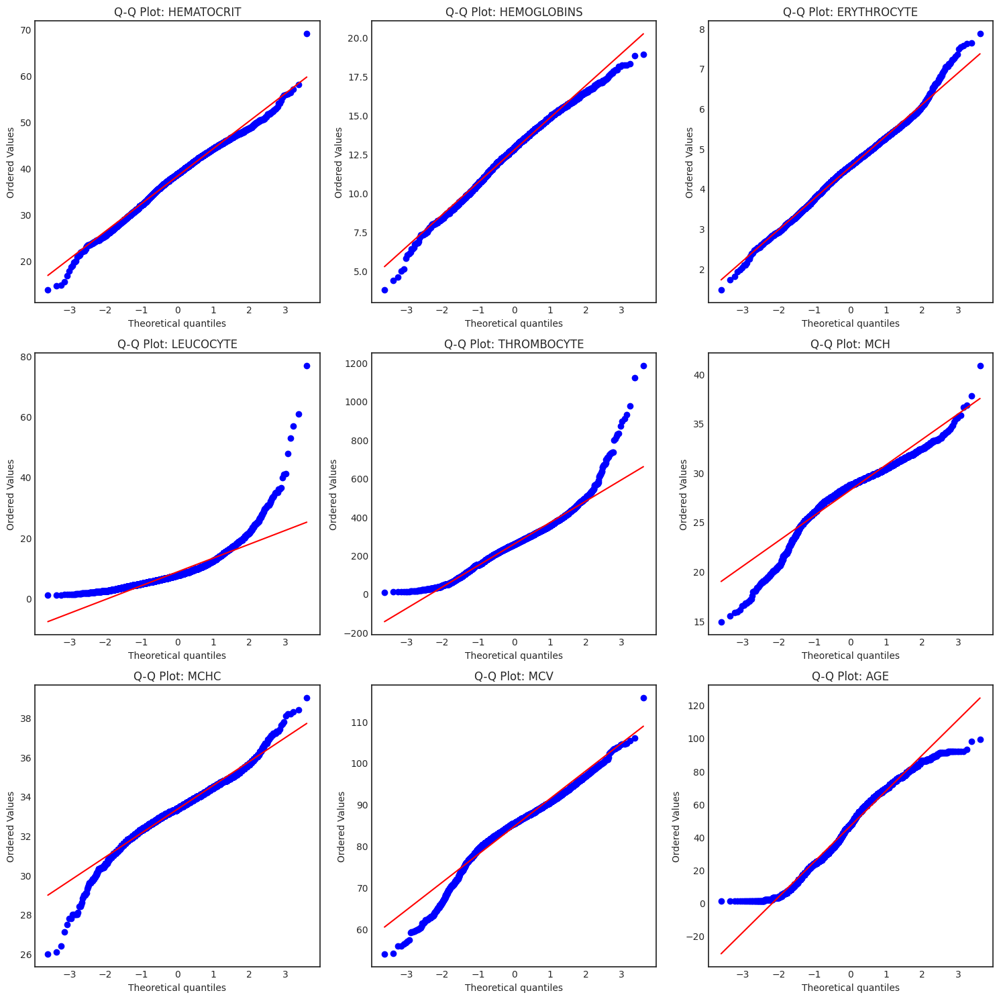
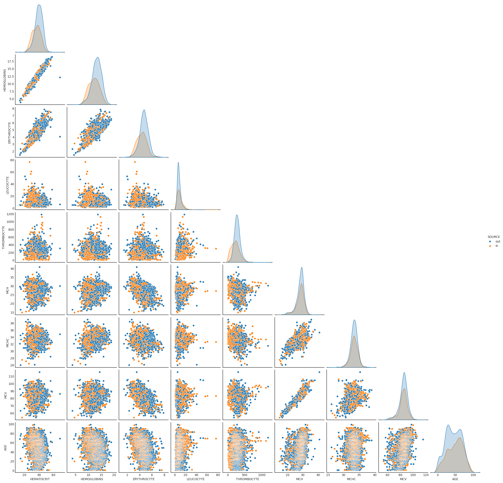

Classification problem. Labels are `in-patient` and `out-patient`. 

## Background

1. **MCH** 
    - Normal range: 27-33 pg/cell
    
    Low MCH  
    - MCH levels below 27 pg/cell are considered low. This could indicate hypochromic anemia, which is when red blood cells have less hemoglobin than normal. Low MCH can be caused by iron deficiency, blood loss, or genetic conditions like thalassemia. 
    
    High MCH  
    - MCH levels above 34 pg/cell are considered high. This could indicate hyperchromic anemia, which is when red blood cells have more hemoglobin than normal. High MCH can be caused by low levels of vitamin B12 or folate, chemotherapy, liver disease, or certain medications. 
    
    Other factors to consider
    - MCH results are usually part of a complete blood count (CBC) test. 
    - Other red blood cell indices, like MCV, MCHC, and RDW, are also considered when interpreting MCH results. 
    - Treatment depends on the cause of the abnormal MCH levels. 

2. **MCHC**
- A normal MCHC result is between 32 and 36 grams per deciliter (g/dL)  

    *Low MCHC*  
    - May indicate iron deficiency anemia
    - May indicate thalassemia, an inherited blood disorder
    - May indicate vitamin B12 deficiency
    - May indicate folate deficiency
    - May indicate lead poisoning
    - May indicate kidney disease

    *High MCHC*  
    - May indicate hereditary spherocytosis
    - May indicate sickle cell anemia
    - May indicate thalassemia
    - May indicate dehydration
    - May indicate polycythemia vera
    - May indicate hemolytic anemia, when red blood cells die faster than they are produced
    
    How is MCHC measured?
    - MCHC is calculated by multiplying the hemoglobin result from a complete blood count (CBC) by 100 and then dividing by the hematocrit result 
    A small blood sample is drawn from a vein in your arm 

3. **MCV**
- test measures the average size of red blood cells in a blood sample. MCV results are reported in femtoliters (fL). 

    Normal MCV range 
    - A normal MCV is typically between 80 and 100 fL
    - A low MCV is less than 80 fL
    - A high MCV is more than 100 fL

    Low MCV
    - A low MCV indicates that red blood cells are smaller than normal 

    This could be a sign of microcytic anemia, which can be caused by: 
    - Iron deficiency 
    - Lead poisoning 
    - Thalassemia, a genetic condition 

    High MCV
    - A high MCV indicates that red blood cells are larger than normal 

    This could be a sign of macrocytic anemia, which can be caused by: 
    - Liver disease 
    - Deficiencies in essential nutrients like vitamin B12 or folate 
    - Other implications

    MCV levels can also be used to diagnose anemia and determine its causes 
    MCV levels may increase over time as part of the normal aging process 

4. **Hematocrit Test**
    Purpose: 
    - To measure the percentage of red blood cells (RBCs) in the blood 
    - To diagnose and monitor conditions that affect RBC production or loss 

    Procedure: 
    - A small amount of blood is drawn from a vein 
    - The blood is centrifuged to separate the RBCs from the other components of blood (plasma and white blood cells) 
    - The volume of RBCs is measured and expressed as a percentage of the total blood volume 

    Normal Range: 
    - Men: 40-54 and Women: 36-46. 

    Interpretation:
    - Low hematocrit (anemia): May indicate blood loss, iron deficiency, bone marrow disorders, or certain cancers 
    - High hematocrit (polycythemia): May indicate dehydration, bone marrow disorders, or blood clots 

    Additional Information: 
    - Hematocrit is often part of a complete blood count (CBC) 
    - Other factors that can affect hematocrit levels include age, altitude, and pregnancy 
    - It is important to inform your healthcare provider about any medications or supplements you are taking before undergoing a hematocrit test


| Name         | Data Type | Value Sample | Description                                      |
|--------------|------------|--------------|--------------------------------------------------|
| HEMATOCRIT  | Continuous | 35.1         | Patient laboratory test result of haematocrit    |
| HEMOGLOBINS | Continuous | 11.8         | Patient laboratory test result of haemoglobins   |
| ERYTHROCYTE  | Continuous | 4.65         | Patient laboratory test result of erythrocyte    |
| LEUCOCYTE    | Continuous | 6.3          | Patient laboratory test result of leucocyte      |
| THROMBOCYTE  | Continuous | 310          | Patient laboratory test result of thrombocyte    |
| MCH          | Continuous | 25.4         | Patient laboratory test result of mean corpuscular hemoglobin            |
| MCHC         | Continuous | 33.6         | Patient laboratory test result of mean corpuscular hemoglobin concentration           |
| MCV          | Continuous | 75.5         | Patient laboratory test result of mean corpuscular volume           |
| AGE          | Continuous | 12           | Patient age                                      |
| SEX          | Nominal – Binary | F     | Patient gender                                   |
| SOURCE       | Nominal    | {in, out}    | The class target: in = in care patient, out = out care patient |


```python
import matplotlib.pyplot as plt
import pandas as pd

import warnings

warnings.filterwarnings(action="ignore")

# Load the data
data = pd.read_csv("data/data-ori.csv")

data = data.rename(columns={"HAEMATOCRIT": "HEMATOCRIT", "HAEMOGLOBINS": "HEMOGLOBINS"})
display(data.info())

data.describe().T
```

    <class 'pandas.core.frame.DataFrame'>
    RangeIndex: 4412 entries, 0 to 4411
    Data columns (total 11 columns):
     #   Column       Non-Null Count  Dtype  
    ---  ------       --------------  -----  
     0   HEMATOCRIT   4412 non-null   float64
     1   HEMOGLOBINS  4412 non-null   float64
     2   ERYTHROCYTE  4412 non-null   float64
     3   LEUCOCYTE    4412 non-null   float64
     4   THROMBOCYTE  4412 non-null   int64  
     5   MCH          4412 non-null   float64
     6   MCHC         4412 non-null   float64
     7   MCV          4412 non-null   float64
     8   AGE          4412 non-null   int64  
     9   SEX          4412 non-null   object 
     10  SOURCE       4412 non-null   object 
    dtypes: float64(7), int64(2), object(2)
    memory usage: 379.3+ KB
    


    None


<div>
<style scoped>
    .dataframe tbody tr th:only-of-type {
        vertical-align: middle;
    }

    .dataframe tbody tr th {
        vertical-align: top;
    }

    .dataframe thead th {
        text-align: right;
    }
</style>
<table border="1" class="dataframe">
  <thead>
    <tr style="text-align: right;">
      <th></th>
      <th>count</th>
      <th>mean</th>
      <th>std</th>
      <th>min</th>
      <th>25%</th>
      <th>50%</th>
      <th>75%</th>
      <th>max</th>
    </tr>
  </thead>
  <tbody>
    <tr>
      <th>HEMATOCRIT</th>
      <td>4412.0</td>
      <td>38.197688</td>
      <td>5.974784</td>
      <td>13.70</td>
      <td>34.375</td>
      <td>38.60</td>
      <td>42.50</td>
      <td>69.00</td>
    </tr>
    <tr>
      <th>HEMOGLOBINS</th>
      <td>4412.0</td>
      <td>12.741727</td>
      <td>2.079903</td>
      <td>3.80</td>
      <td>11.400</td>
      <td>12.90</td>
      <td>14.20</td>
      <td>18.90</td>
    </tr>
    <tr>
      <th>ERYTHROCYTE</th>
      <td>4412.0</td>
      <td>4.541260</td>
      <td>0.784091</td>
      <td>1.48</td>
      <td>4.040</td>
      <td>4.57</td>
      <td>5.05</td>
      <td>7.86</td>
    </tr>
    <tr>
      <th>LEUCOCYTE</th>
      <td>4412.0</td>
      <td>8.718608</td>
      <td>5.049041</td>
      <td>1.10</td>
      <td>5.675</td>
      <td>7.60</td>
      <td>10.30</td>
      <td>76.60</td>
    </tr>
    <tr>
      <th>THROMBOCYTE</th>
      <td>4412.0</td>
      <td>257.524479</td>
      <td>113.972365</td>
      <td>8.00</td>
      <td>188.000</td>
      <td>256.00</td>
      <td>321.00</td>
      <td>1183.00</td>
    </tr>
    <tr>
      <th>MCH</th>
      <td>4412.0</td>
      <td>28.234701</td>
      <td>2.672639</td>
      <td>14.90</td>
      <td>27.200</td>
      <td>28.70</td>
      <td>29.80</td>
      <td>40.80</td>
    </tr>
    <tr>
      <th>MCHC</th>
      <td>4412.0</td>
      <td>33.343042</td>
      <td>1.228664</td>
      <td>26.00</td>
      <td>32.700</td>
      <td>33.40</td>
      <td>34.10</td>
      <td>39.00</td>
    </tr>
    <tr>
      <th>MCV</th>
      <td>4412.0</td>
      <td>84.612942</td>
      <td>6.859101</td>
      <td>54.00</td>
      <td>81.500</td>
      <td>85.40</td>
      <td>88.70</td>
      <td>115.60</td>
    </tr>
    <tr>
      <th>AGE</th>
      <td>4412.0</td>
      <td>46.626473</td>
      <td>21.731218</td>
      <td>1.00</td>
      <td>29.000</td>
      <td>47.00</td>
      <td>64.00</td>
      <td>99.00</td>
    </tr>
  </tbody>
</table>
</div>


```python
data.head()
```


<div>
<style scoped>
    .dataframe tbody tr th:only-of-type {
        vertical-align: middle;
    }

    .dataframe tbody tr th {
        vertical-align: top;
    }

    .dataframe thead th {
        text-align: right;
    }
</style>
<table border="1" class="dataframe">
  <thead>
    <tr style="text-align: right;">
      <th></th>
      <th>HEMATOCRIT</th>
      <th>HEMOGLOBINS</th>
      <th>ERYTHROCYTE</th>
      <th>LEUCOCYTE</th>
      <th>THROMBOCYTE</th>
      <th>MCH</th>
      <th>MCHC</th>
      <th>MCV</th>
      <th>AGE</th>
      <th>SEX</th>
      <th>SOURCE</th>
    </tr>
  </thead>
  <tbody>
    <tr>
      <th>0</th>
      <td>35.1</td>
      <td>11.8</td>
      <td>4.65</td>
      <td>6.3</td>
      <td>310</td>
      <td>25.4</td>
      <td>33.6</td>
      <td>75.5</td>
      <td>1</td>
      <td>F</td>
      <td>out</td>
    </tr>
    <tr>
      <th>1</th>
      <td>43.5</td>
      <td>14.8</td>
      <td>5.39</td>
      <td>12.7</td>
      <td>334</td>
      <td>27.5</td>
      <td>34.0</td>
      <td>80.7</td>
      <td>1</td>
      <td>F</td>
      <td>out</td>
    </tr>
    <tr>
      <th>2</th>
      <td>33.5</td>
      <td>11.3</td>
      <td>4.74</td>
      <td>13.2</td>
      <td>305</td>
      <td>23.8</td>
      <td>33.7</td>
      <td>70.7</td>
      <td>1</td>
      <td>F</td>
      <td>out</td>
    </tr>
    <tr>
      <th>3</th>
      <td>39.1</td>
      <td>13.7</td>
      <td>4.98</td>
      <td>10.5</td>
      <td>366</td>
      <td>27.5</td>
      <td>35.0</td>
      <td>78.5</td>
      <td>1</td>
      <td>F</td>
      <td>out</td>
    </tr>
    <tr>
      <th>4</th>
      <td>30.9</td>
      <td>9.9</td>
      <td>4.23</td>
      <td>22.1</td>
      <td>333</td>
      <td>23.4</td>
      <td>32.0</td>
      <td>73.0</td>
      <td>1</td>
      <td>M</td>
      <td>out</td>
    </tr>
  </tbody>
</table>
</div>


```python
data.duplicated().sum()
```


    np.int64(0)


```python
data.SEX.value_counts()
```


    SEX
    M    2290
    F    2122
    Name: count, dtype: int64


```python
data.SOURCE.value_counts()
```


    SOURCE
    out    2628
    in     1784
    Name: count, dtype: int64


Unequal distribution of labels between the two classifications


```python
# plt.style.available
```


```python
plt.style.use("seaborn-v0_8-white")

data.hist(
    bins=50,
    figsize=(15, 10),
)
```


    array([[<Axes: title={'center': 'HEMATOCRIT'}>,
            <Axes: title={'center': 'HEMOGLOBINS'}>,
            <Axes: title={'center': 'ERYTHROCYTE'}>],
           [<Axes: title={'center': 'LEUCOCYTE'}>,
            <Axes: title={'center': 'THROMBOCYTE'}>,
            <Axes: title={'center': 'MCH'}>],
           [<Axes: title={'center': 'MCHC'}>,
            <Axes: title={'center': 'MCV'}>, <Axes: title={'center': 'AGE'}>]],
          dtype=object)


    

    


### Distribution of data

Test|Null Hypothesis 𝐻0 |Recommended for|
---|---|---
Shapiro-Wilk|Data is normally distributed|Small datasets (< 5000)
Kolmogorov-Smirnov|Data is from a normal distribution|General cases
Anderson-Darling|Data is from a normal distribution|More strict test
D'Agostino-Pearson|Data is normally distributed|Large datasets


- If p-value < 0.05 → Reject normality assumption.
- If p-value > 0.05 → Fail to reject normality (data may be normal).


```python
# continuous features
cont_features = data.select_dtypes(include=["float64", "int64"]).columns
print(cont_features)
print(len(cont_features))
```

    Index(['HEMATOCRIT', 'HEMOGLOBINS', 'ERYTHROCYTE', 'LEUCOCYTE', 'THROMBOCYTE',
           'MCH', 'MCHC', 'MCV', 'AGE'],
          dtype='object')
    9
    


```python
# Distribution testing
import scipy.stats as stats

# Q-Q Plot
# grid of 3x3 plots
fig, axs = plt.subplots(3, 3, figsize=(15, 15))
axs = axs.flatten()

for i, c in enumerate(data[cont_features]):
    stats.probplot(data[c], dist="norm", plot=axs[i])
    axs[i].set_title(f"Q-Q Plot: {c}")
plt.tight_layout()
plt.show()
```


    

    


The **Shapiro-Wilk test** checks if the data is normally distributed. If p-value < 0.05, the null hypothesis (normality) is rejected.

Sensitive to large sample sizes (<5000)


```python
from scipy.stats import shapiro


def shapiro_test(data):
    stat, p = shapiro(data)
    # print(f"Shapiro-Wilk Test Statistic: {stat:.4f}, p-value: {p:.4f}")

    # if p > 0.05:
    #     print("Data likely follows a normal distribution (Fail to Reject H0).")
    # else:
    #     print("Data does not follow a normal distribution (Reject H0).")

    return stat, p


results = []
for c in cont_features:
    stat, p = shapiro_test(data[c])
    results.append({"Name": c, "Stat": stat, "P-Value": p, "Normality": p > 0.05})

pd.DataFrame(results)
```


<div>
<style scoped>
    .dataframe tbody tr th:only-of-type {
        vertical-align: middle;
    }

    .dataframe tbody tr th {
        vertical-align: top;
    }

    .dataframe thead th {
        text-align: right;
    }
</style>
<table border="1" class="dataframe">
  <thead>
    <tr style="text-align: right;">
      <th></th>
      <th>Name</th>
      <th>Stat</th>
      <th>P-Value</th>
      <th>Normality</th>
    </tr>
  </thead>
  <tbody>
    <tr>
      <th>0</th>
      <td>HEMATOCRIT</td>
      <td>0.991517</td>
      <td>1.381605e-15</td>
      <td>False</td>
    </tr>
    <tr>
      <th>1</th>
      <td>HEMOGLOBINS</td>
      <td>0.992760</td>
      <td>3.513618e-14</td>
      <td>False</td>
    </tr>
    <tr>
      <th>2</th>
      <td>ERYTHROCYTE</td>
      <td>0.994959</td>
      <td>3.050999e-11</td>
      <td>False</td>
    </tr>
    <tr>
      <th>3</th>
      <td>LEUCOCYTE</td>
      <td>0.811012</td>
      <td>5.201424e-58</td>
      <td>False</td>
    </tr>
    <tr>
      <th>4</th>
      <td>THROMBOCYTE</td>
      <td>0.958953</td>
      <td>1.361568e-33</td>
      <td>False</td>
    </tr>
    <tr>
      <th>5</th>
      <td>MCH</td>
      <td>0.924809</td>
      <td>1.895751e-42</td>
      <td>False</td>
    </tr>
    <tr>
      <th>6</th>
      <td>MCHC</td>
      <td>0.971661</td>
      <td>1.051493e-28</td>
      <td>False</td>
    </tr>
    <tr>
      <th>7</th>
      <td>MCV</td>
      <td>0.956967</td>
      <td>3.030938e-34</td>
      <td>False</td>
    </tr>
    <tr>
      <th>8</th>
      <td>AGE</td>
      <td>0.981101</td>
      <td>8.021103e-24</td>
      <td>False</td>
    </tr>
  </tbody>
</table>
</div>


**Kolmogorov-Smirnov Test**
Compares the sample with a normal distribution.


```python
from scipy.stats import kstest


def kstest_test(data):
    stat, p = kstest(data, "norm", args=(data.mean(), data.std()))
    # print(f"Kolmogorov-Smirnov Test Statistic: {stat:.4f}, p-value: {p:.4f}")

    return stat, p
    # if p > 0.05:
    #     print("Data likely follows a normal distribution (Fail to Reject H0).")
    # else:
    #     print("Data does not follow a normal distribution (Reject H0).")


results = []
for c in cont_features:
    stat, p = kstest_test(data[c])
    results.append({"Name": c, "Stat": stat, "P-Value": p, "Normality": p > 0.05})

pd.DataFrame(results)
```


<div>
<style scoped>
    .dataframe tbody tr th:only-of-type {
        vertical-align: middle;
    }

    .dataframe tbody tr th {
        vertical-align: top;
    }

    .dataframe thead th {
        text-align: right;
    }
</style>
<table border="1" class="dataframe">
  <thead>
    <tr style="text-align: right;">
      <th></th>
      <th>Name</th>
      <th>Stat</th>
      <th>P-Value</th>
      <th>Normality</th>
    </tr>
  </thead>
  <tbody>
    <tr>
      <th>0</th>
      <td>HEMATOCRIT</td>
      <td>0.037901</td>
      <td>6.077443e-06</td>
      <td>False</td>
    </tr>
    <tr>
      <th>1</th>
      <td>HEMOGLOBINS</td>
      <td>0.038720</td>
      <td>3.490837e-06</td>
      <td>False</td>
    </tr>
    <tr>
      <th>2</th>
      <td>ERYTHROCYTE</td>
      <td>0.030959</td>
      <td>4.154877e-04</td>
      <td>False</td>
    </tr>
    <tr>
      <th>3</th>
      <td>LEUCOCYTE</td>
      <td>0.132824</td>
      <td>2.448857e-68</td>
      <td>False</td>
    </tr>
    <tr>
      <th>4</th>
      <td>THROMBOCYTE</td>
      <td>0.047058</td>
      <td>6.271936e-09</td>
      <td>False</td>
    </tr>
    <tr>
      <th>5</th>
      <td>MCH</td>
      <td>0.102923</td>
      <td>3.821745e-41</td>
      <td>False</td>
    </tr>
    <tr>
      <th>6</th>
      <td>MCHC</td>
      <td>0.059793</td>
      <td>3.737124e-14</td>
      <td>False</td>
    </tr>
    <tr>
      <th>7</th>
      <td>MCV</td>
      <td>0.079079</td>
      <td>1.910817e-24</td>
      <td>False</td>
    </tr>
    <tr>
      <th>8</th>
      <td>AGE</td>
      <td>0.059289</td>
      <td>6.353435e-14</td>
      <td>False</td>
    </tr>
  </tbody>
</table>
</div>


**Anderson-Darling Test**
A more powerful normality test.


```python
from scipy.stats import anderson


def anderson_test(data):
    result = anderson(data, dist="norm")
    # print("Anderson-Darling Test Statistic:", result.statistic)
    # print("Critical Values:", result.critical_values)
    # print("Significance Levels:", result.significance_level)

    # if result.statistic < result.critical_values[2]:  # 5% significance level
    #     print("Data likely follows a normal distribution.")
    # else:
    #     print("Data does not follow a normal distribution.")

    return result


results = []
for c in cont_features:
    result = anderson_test(data[c])
    results.append(
        {
            "Name": c,
            "Statistic": result.statistic,
            "Critical Values": ",".join([str(r) for r in result.critical_values]),
            "Significance Levels": ",".join(
                [str(r) for r in result.significance_level]
            ),
            "Result": result.statistic < result.critical_values[2],
        }
    )

pd.DataFrame(results)
```


<div>
<style scoped>
    .dataframe tbody tr th:only-of-type {
        vertical-align: middle;
    }

    .dataframe tbody tr th {
        vertical-align: top;
    }

    .dataframe thead th {
        text-align: right;
    }
</style>
<table border="1" class="dataframe">
  <thead>
    <tr style="text-align: right;">
      <th></th>
      <th>Name</th>
      <th>Statistic</th>
      <th>Critical Values</th>
      <th>Significance Levels</th>
      <th>Result</th>
    </tr>
  </thead>
  <tbody>
    <tr>
      <th>0</th>
      <td>HEMATOCRIT</td>
      <td>10.894209</td>
      <td>0.575,0.655,0.786,0.917,1.091</td>
      <td>15.0,10.0,5.0,2.5,1.0</td>
      <td>False</td>
    </tr>
    <tr>
      <th>1</th>
      <td>HEMOGLOBINS</td>
      <td>8.742803</td>
      <td>0.575,0.655,0.786,0.917,1.091</td>
      <td>15.0,10.0,5.0,2.5,1.0</td>
      <td>False</td>
    </tr>
    <tr>
      <th>2</th>
      <td>ERYTHROCYTE</td>
      <td>5.404993</td>
      <td>0.575,0.655,0.786,0.917,1.091</td>
      <td>15.0,10.0,5.0,2.5,1.0</td>
      <td>False</td>
    </tr>
    <tr>
      <th>3</th>
      <td>LEUCOCYTE</td>
      <td>161.562318</td>
      <td>0.575,0.655,0.786,0.917,1.091</td>
      <td>15.0,10.0,5.0,2.5,1.0</td>
      <td>False</td>
    </tr>
    <tr>
      <th>4</th>
      <td>THROMBOCYTE</td>
      <td>16.424005</td>
      <td>0.575,0.655,0.786,0.917,1.091</td>
      <td>15.0,10.0,5.0,2.5,1.0</td>
      <td>False</td>
    </tr>
    <tr>
      <th>5</th>
      <td>MCH</td>
      <td>88.992180</td>
      <td>0.575,0.655,0.786,0.917,1.091</td>
      <td>15.0,10.0,5.0,2.5,1.0</td>
      <td>False</td>
    </tr>
    <tr>
      <th>6</th>
      <td>MCHC</td>
      <td>21.638782</td>
      <td>0.575,0.655,0.786,0.917,1.091</td>
      <td>15.0,10.0,5.0,2.5,1.0</td>
      <td>False</td>
    </tr>
    <tr>
      <th>7</th>
      <td>MCV</td>
      <td>51.877987</td>
      <td>0.575,0.655,0.786,0.917,1.091</td>
      <td>15.0,10.0,5.0,2.5,1.0</td>
      <td>False</td>
    </tr>
    <tr>
      <th>8</th>
      <td>AGE</td>
      <td>22.359715</td>
      <td>0.575,0.655,0.786,0.917,1.091</td>
      <td>15.0,10.0,5.0,2.5,1.0</td>
      <td>False</td>
    </tr>
  </tbody>
</table>
</div>


**D'Agostino and Pearson’s Test**
This tests for skewness and kurtosis.


```python
from scipy.stats import normaltest


def normaltest_test(data):
    stat, p = normaltest(data)
    return stat, p

    # print(f"D'Agostino-Pearson Test Statistic: {stat:.4f}, p-value: {p:.4f}")

    # if p > 0.05:
    #     print("Data likely follows a normal distribution (Fail to Reject H0).")
    # else:
    #     print("Data does not follow a normal distribution (Reject H0).")


results = []
for c in cont_features:
    stat, p = kstest_test(data[c])
    results.append({"Name": c, "Stat": stat, "P-Value": p, "Reslut": p > 0.05})

pd.DataFrame(results)
```


<div>
<style scoped>
    .dataframe tbody tr th:only-of-type {
        vertical-align: middle;
    }

    .dataframe tbody tr th {
        vertical-align: top;
    }

    .dataframe thead th {
        text-align: right;
    }
</style>
<table border="1" class="dataframe">
  <thead>
    <tr style="text-align: right;">
      <th></th>
      <th>Name</th>
      <th>Stat</th>
      <th>P-Value</th>
      <th>Reslut</th>
    </tr>
  </thead>
  <tbody>
    <tr>
      <th>0</th>
      <td>HEMATOCRIT</td>
      <td>0.037901</td>
      <td>6.077443e-06</td>
      <td>False</td>
    </tr>
    <tr>
      <th>1</th>
      <td>HEMOGLOBINS</td>
      <td>0.038720</td>
      <td>3.490837e-06</td>
      <td>False</td>
    </tr>
    <tr>
      <th>2</th>
      <td>ERYTHROCYTE</td>
      <td>0.030959</td>
      <td>4.154877e-04</td>
      <td>False</td>
    </tr>
    <tr>
      <th>3</th>
      <td>LEUCOCYTE</td>
      <td>0.132824</td>
      <td>2.448857e-68</td>
      <td>False</td>
    </tr>
    <tr>
      <th>4</th>
      <td>THROMBOCYTE</td>
      <td>0.047058</td>
      <td>6.271936e-09</td>
      <td>False</td>
    </tr>
    <tr>
      <th>5</th>
      <td>MCH</td>
      <td>0.102923</td>
      <td>3.821745e-41</td>
      <td>False</td>
    </tr>
    <tr>
      <th>6</th>
      <td>MCHC</td>
      <td>0.059793</td>
      <td>3.737124e-14</td>
      <td>False</td>
    </tr>
    <tr>
      <th>7</th>
      <td>MCV</td>
      <td>0.079079</td>
      <td>1.910817e-24</td>
      <td>False</td>
    </tr>
    <tr>
      <th>8</th>
      <td>AGE</td>
      <td>0.059289</td>
      <td>6.353435e-14</td>
      <td>False</td>
    </tr>
  </tbody>
</table>
</div>


# Correlations


```python
import seaborn as sns
```


```python
sns.pairplot(data, diag_kind="kde", corner=True)
```


    <seaborn.axisgrid.PairGrid at 0x7f81096c8200>


    

    


```python
import numpy as np

# Calculate the correlation matrix
corr_matrix = data[cont_features].corr()

# Plot the heatmap
mask = np.triu(np.ones_like(corr_matrix, dtype=bool))
plt.figure(figsize=(10, 8))
sns.heatmap(
    corr_matrix, annot=True, cmap="coolwarm", fmt=".2f", linewidths=0.5, mask=mask
)
plt.title("Heatmap of Correlations for Continuous Variables")
plt.show()
```


    

    


```python

```

Not suprising to have correlations between: 
- Hemoglobins, erythroctye, and hematocrit

# By Treatment Type


```python
sns.pairplot(data, diag_kind="kde", corner=True, hue="SOURCE")
```


    <seaborn.axisgrid.PairGrid at 0x7f80fa747350>


    

    


```python
sns.displot(x="SOURCE", y="AGE", data=data)
```


    <Axes: xlabel='SOURCE', ylabel='AGE'>


    

    


```python
fig, axs = plt.subplots(
    1, 2, figsize=(15, 7)
)  # Adjusted figsize for better aspect ratio
axs = axs.flatten()

for i, c in enumerate(data["SOURCE"].unique()):
    # Calculate the correlation matrix
    corr_matrix = data.loc[data["SOURCE"] == c, cont_features].corr()

    # Plot the heatmap
    mask = np.triu(np.ones_like(corr_matrix, dtype=bool))
    sns.heatmap(
        corr_matrix,
        annot=True,
        cmap="coolwarm",
        fmt=".2f",
        linewidths=0.5,
        mask=mask,
        ax=axs[i],
    )
    axs[i].set_title(f"Heatmap of Correlations for Continuous Variables (SOURCE={c})")

plt.tight_layout()
plt.show()
```


    

    


Since the data is not normally distributed, using a Mann-Whitney U Test


```python
from scipy.stats import mannwhitneyu

# Interpretation
alpha = 0.05

u_stat, p_value = mannwhitneyu(
    data.loc[data["SOURCE"] == "out", "AGE"],
    data.loc[data["SOURCE"] == "in", "AGE"],
    alternative="two-sided",
)

print(f"U-statistic: {u_stat}, P-value: {p_value}")

if p_value < alpha:
    print("Reject the null hypothesis: The distributions are significantly different.")
else:
    print(
        "Fail to reject the null hypothesis: No significant difference in distributions."
    )
```

    U-statistic: 2041497.0, P-value: 3.0956410863324527e-13
    Reject the null hypothesis: The distributions are significantly different.
    
